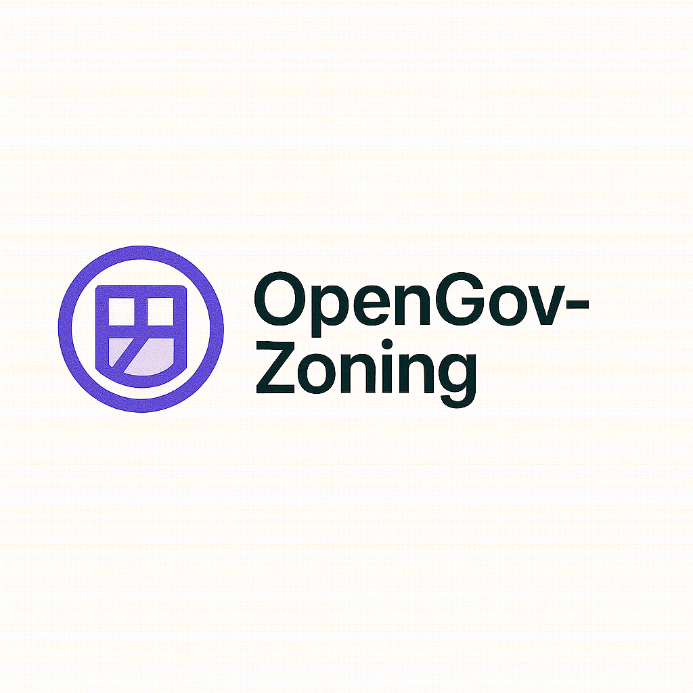

# OpenGov-Zoning



**Comprehensive land use planning and permitting intelligence system for infrastructure projects across US municipalities**

[](https://opensource.org/licenses/MIT)
[](https://python.org/downloads/)
[](https://github.com/llamasearchai/OpenGov-Zoning/actions/workflows/ci.yml)

OpenGov Zoning is a production-grade Python system designed to analyze zoning documents and comprehensive plans for infrastructure development projects. The system integrates AI/ML capabilities with GIS data to provide permitting intelligence and regulatory analysis for renewable energy, data centers, and telecommunications infrastructure.

Coverage: All 50 U.S. states and the District of Columbia.

## Key Features

- **AI-Powered Document Analysis**: Integrated OpenAI Agents SDK and Ollama support for zoning document interpretation
- **GIS Integration**: Complete geospatial analysis and mapping capabilities
- **Permitting Intelligence**: Automated permit requirement extraction and pathway analysis
- **Multi-Provider LLM Support**: Graceful fallback between OpenAI, Ollama, and local models
- **Municipal Data**: Pre-configured for US municipal codes and comprehensive plans
- **Infrastructure Focus**: Specialized for renewable energy, data centers, and telecom projects

## Table of Contents

- [Installation](#installation)
- [Quick Start](#quick-start)
- [Usage](#usage)
- [Configuration](#configuration)
- [API Reference](#api-reference)
- [Contributing](#contributing)
- [License](#license)

## Installation

### Prerequisites

- Python 3.11 or higher
- uv (recommended) or pip
- SQLite 3.8 or higher
- Optional: Ollama for local LLM support
- Optional: GDAL and GEOS for GIS functionality

### Install with uv (Recommended)

```bash
# Clone the repository
git clone https://github.com/llamasearchai/OpenGov-Zoning.git
cd OpenGov-Zoning

# Create virtual environment and install dependencies
uv venv
uv sync

# Activate virtual environment
source .venv/bin/activate  # On Windows: .venv\Scripts\activate
```

### Install with pip

```bash
pip install -e .
```

### Optional: Install Ollama for Local LLM Support

```bash
# Install Ollama
curl -fsSL https://ollama.ai/install.sh | sh

# Pull required models
ollama pull llama2:7b
ollama pull codellama:13b
```

### Optional: Install GIS Dependencies

```bash
# On Ubuntu/Debian
sudo apt-get install gdal-bin libgdal-dev
sudo apt-get install libspatialindex-dev

# On macOS
brew install gdal
brew install spatialindex
```

## Quick Start

1. **Initialize the demo database**:
   ```bash
   opengov-zoning db init --drop-existing
   opengov-zoning db seed
   ```

2. **Start the FastAPI service**:
   ```bash
   opengov-zoning serve --host 0.0.0.0 --port 8000
   ```

3. **Run your first zoning analysis**:
   ```bash
   opengov-zoning agent run "Analyze zoning requirements for solar farm in Austin, TX"
   ```

4. **Explore the CLI workflows**:
   ```bash
   opengov-zoning query jurisdiction --city "Austin" --use "solar-farm"
   ```

## Usage

### Command Line Interface

OpenGov Zoning provides a comprehensive CLI with the following main commands:

```bash
opengov-zoning --help
```

#### Core Commands

- `agent run/chat/tools` - AI-powered document analysis and permit requirement extraction
- `ingest` - Import municipal documents and GIS data
- `db init/migrate/seed` - Database management
- `query` - Jurisdiction analysis and permit pathway determination
- `eval` - Extraction accuracy metrics
- `serve-datasette` - Planning intelligence dashboard
- `llm run` - Direct model access for document interpretation
- `ollama pull/models/list` - Regulatory NLP model management
- `menu` - Interactive mode for planners

#### Example Workflows

**Zoning Analysis Workflow**:
```bash
# Ingest municipal documents
opengov-zoning ingest documents --directory /path/to/zoning-docs

# Analyze permit requirements
opengov-zoning agent run "Extract permit requirements for data center development in San Jose"

# Query jurisdiction information
opengov-zoning query jurisdiction --city "San Francisco" --use "solar-farm"

# Generate permit pathway
opengov-zoning agent tools generate-pathway --project-type "renewable-energy"
```

**GIS Analysis**:
```bash
# Pull GIS model
opengov-zoning ollama pull "gis-analysis:latest"

# Analyze parcel data
opengov-zoning llm run spatial-analyzer --parcel-id "12345" --analysis-type "zoning-compliance"

# Compare jurisdictions
opengov-zoning agent tools compare-zoning --city1 "Austin" --city2 "Denver" --use "telecom-tower"
```

### Programmatic Usage

```python
from opengovzoning.client import ZoningClient
from opengovzoning.models import Project, Jurisdiction

# Initialize client
client = ZoningClient()

# Define project
project = Project(
    project_type="data-center",
    location="Austin, TX",
    size_acres=10,
    building_height=150
)

# Analyze zoning requirements
analysis = client.analyze_zoning(project)

# Query permit pathways
pathways = client.query_permit_pathways(
    jurisdiction="Austin",
    project_type="data-center"
)

print(f"Zoning districts: {analysis.zoning_districts}")
print(f"Required permits: {analysis.required_permits}")
print(f"Estimated timeline: {pathways.estimated_days} days")
```

## Configuration

OpenGov Zoning uses Pydantic settings for configuration management. Copy the example environment file and modify as needed:

```bash
cp .env.example .env
```

### Key Configuration Options

```toml
# .env file
# GIS service endpoints
GIS_API_BASE="https://gis.company.com/api"
GIS_API_KEY="your-gis-api-key"

# Document parsing parameters
MAX_DOCUMENT_SIZE_MB=50
SUPPORTED_FORMATS="pdf,docx,txt,html"

# Customer project templates
PROJECT_TEMPLATES_DIR="/path/to/templates"
DEFAULT_JURISDICTION="California"

# LLM Providers
OPENAI_API_KEY="sk-your-openai-key"
OLLAMA_BASE_URL="http://localhost:11434"

# Analysis settings
CONFIDENCE_THRESHOLD=0.85
MAX_CONCURRENT_ANALYSES=5
```

## Architecture

OpenGov Zoning follows a modular architecture designed for scalability and maintainability:

```
src/openzoning/
├── cli/                 # Command-line interface
├── core/                # Core business logic
├── models/              # Pydantic data models
├── services/            # External service integrations
├── storage/             # Database and file operations
├── agents/              # AI/ML agent implementations
├── web/                 # Web interface components
├── gis/                 # GIS and spatial analysis
└── utils/               # Utility functions
```

### Key Components

- **Agent Layer**: OpenAI Assistants API integration with fallback to Ollama
- **Database Layer**: SQLite with sqlite-utils for data management
- **GIS Layer**: Geospatial analysis with GeoPandas and Shapely
- **Web Layer**: Datasette for planning intelligence dashboards
- **Analysis Layer**: Custom document processing and regulatory analysis
- **Security Layer**: Customer data protection and confidentiality

## Security & Compliance

OpenGov Zoning includes comprehensive security and compliance features:

- **Data Source Verification**: Automated validation of municipal document authenticity
- **Jurisdiction Boundary Validation**: GIS-based boundary checking
- **Document Currency Checks**: Automated verification of code currency
- **Customer Data Protection**: Proprietary project data safeguards
- **Audit Trails**: Structured logging for customer project tracking
- **Access Controls**: Role-based permissions for different user types

## Infrastructure Impact

OpenGov Zoning provides tangible benefits for American infrastructure development:

- **Accelerated Renewable Energy**: Faster solar and wind project permitting
- **Data Center Optimization**: Efficient site selection and zoning analysis
- **Telecom Infrastructure**: Streamlined tower and network planning
- **Transparent Pathways**: Clear permitting requirements and timelines
- **Cost Reduction**: Reduced legal and consulting fees
- **Infrastructure Buildout**: Support for $2T infrastructure investment

## Contributing

We welcome contributions from the planning and GIS communities! Please see our [Contributing Guide](CONTRIBUTING.md) for details.

### Development Setup

```bash
# Fork and clone
git clone https://github.com/your-username/OpenGov-Zoning.git
cd OpenGov-Zoning

# Install development dependencies
uv sync --extra dev

# Run tests
uv run pytest

# Run linters
uv run ruff check .
uv run mypy src/

# Format code
uv run black src/
uv run isort src/
```

## License

This project is licensed under the MIT License - see the [LICENSE](LICENSE) file for details.

## Acknowledgments

- US municipalities and planning departments
- Renewable energy developers
- Data center operators
- Telecommunications companies
- OpenAI for AI capabilities
- Ollama for local LLM support

## Support

- **Repository**: [OpenGov-Zoning on GitHub](https://github.com/llamasearchai/OpenGov-Zoning)
- **Issues**: [GitHub Issues](https://github.com/llamasearchai/OpenGov-Zoning/issues)
- **Discussions**: [GitHub Discussions](https://github.com/llamasearchai/OpenGov-Zoning/discussions)
- **Email**: nikjois@llamasearch.ai

---

**Built with care for infrastructure development by Nik Jois**
